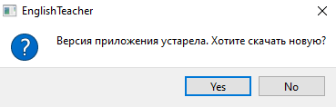
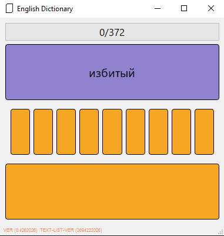
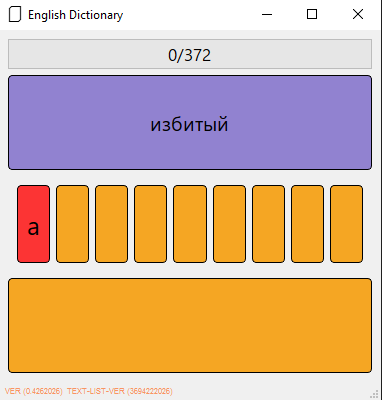
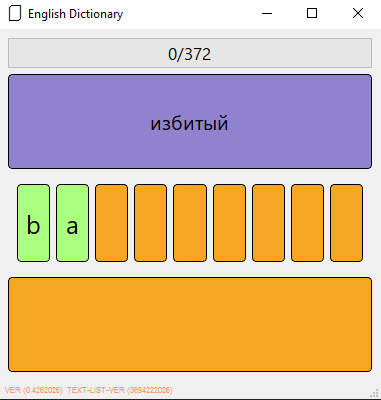
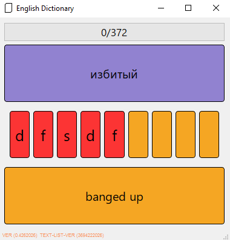
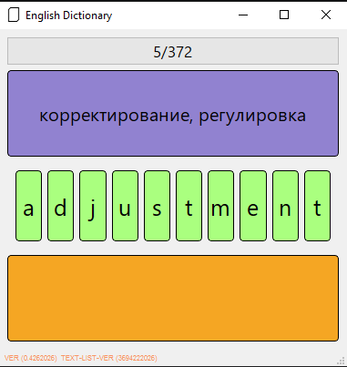
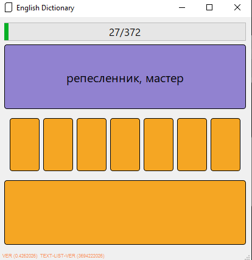

# English Dictionary

### Основные пункты документации 
- [Предисловие](#предисловие)
- [Текущий функционал ](#текущий-функционал)
- [Заключение](#заключение)

### Предисловие

<b>

На данном этапе приложение я создаю и развиваю в первую очередь для себя. Чтобы закреплять слова из английского которые или забываются или встречаются мне в первый раз.

В какой то момент решил что будет не лишним поделиться с этим с интернетом как и планами по разработке, и возможно, это вылиться во что то более серьёзное, а так же качественно лучшее для обучения, и закрепления навыков.

</b>


## Текущий функционал 

<b>Разделю данный пункт на два основных. В первом пункте мы рассмотрим классы и задачи которые они выполняют. Во втором как выглядит и работает приложение. : </b>

-  [Техническая составляющая](#техническая-составляющая)
-  [Пользовательская составляющая](#пользовательская-составляющая)


### Техническая составляющая

<b>

- #### MainWindow
    Класс обрабатывающий действия пользователя непосредственно через интерфейс

- #### FileDownloader
    Класс отвечающий за скачивание текущего словаря из репозитория. А так же обработка полученных данных для использование оных в других частях кода.

- #### Stats
    Класс отвечающий за составление и запись статистики пользователя. А так же запись актуального словаря.В статистике хранятся слова, значения и соотношения правильных и неправильных ответов :
``` json
{
    "abolish": {
    "ratio": 0,
    "ru": "отменять, упразднять, уничтожать"
    },
    "abundant": {
        "ratio": 0,
        "ru": "обильный, богатый, изобилующий"
    },
    "accent": {
        "ratio": 2,
        "ru": "акцент"
    }, ...
}
```

- #### TranslationTTSWidget 
    Класс который отправляет URL запрос к Google API ```translate.google.com/translate_tts``` которое отвечает за воспроизведение слова. Таким образом приложение позволяет не только видеть перевод слова на русский и наоборот, а в том числе слушать как это слово звучит на англиком.

- #### Versioncontroller 
    Класс который отвечает за проверку актуальной версии приложения. В случай если версия является устаревшей предлагает перейти к скачиванию и открывает необходимую ссылку в браузере по умолчанию.

</b>

### Пользовательская составляющая

Пройдёмся по порядку от начала и до конца того как приложение работает при запуска и впоследствии заканчивает :

- Приложение скачивается с актуальным списком слов изначально. И считывает его.

- Если компьютер имеет подключение к сети - скачивает и проверяет актуальные данные. Как по словарю, так и по версии приложения.

- Обновления слов проходит автоматически, добавляя новые слова в уже существующую статистику не изменяя существующих данных. Ваша статистика останется не тронутой.

- При наличии новой версии приложения. Откроется окно, которое предлагает скачать обновление.



- В случай если мы соглашаемся - Программа открывает ссылку на репозиторий где можно скачать актуальную версию. В случай отказа - Программа продолжает работу.

- После окончания обработки данных открывается само приложение.



Рассмотрим его сверху вниз. В самом верху расположена шкала прогресса с количеством пройденных слов и оставшихся. Русское значение текущего загаданного слова. Ещё ниже пользовательский инпут. Для работы с ним раскладка должна быть на английском. Ещё ниже пустое на данный момент окно, где будет отображаться подсказка в случай неправильно ответа, после небольшой задержки подсказка скрывается. В самом низу приложения мелким шрифтом написана версия приложения и словаря

- В вводе участвует :
    - Вся раскладка англииского языка от a-z. 
    - Клавиша enter для подтверждения ввода.
    - space для пробелов.
    - backspace для удаления символов.
    - Апостроф  ```'``` для слов где он наличествует.

- После начала ввода мы видим отображение его в отдельных элементах на экране. Где визуальная подсказка даёт нам понять когда мы ошиблись при вводе а когда ввод был корректный




- В случай если слово нам не знаком - не переживайте. Достаточно нажать **enter** и мы увидим подсказку. Упомяну так же что при наличии интернета каждый **enter** будет сопровождаться воспроизведением произношения загаданного слова.



- Результат прохождения вами заданий фиксируется - Чем больше вы корректно отвечаете на слово тем реже программа вам его выдаёт, и наоборот, если отвечать некорректно слово будет чаще вам встречаться. **Для обновления статистики необходимо завершать работу приложения.**

- После того как мы выполним корректный ввод слово измениться на новое. Как и счётчик в верхней части приложения.



- После того как мы совершим достаточно количество корректных вводов мы сможем увидеть шкалу прогресса. Это не так важно так как это чисто визуальный эффект.



- Как только вы полностью пройдётесь по всему списку - приложение автоматически закроется и так же запишет статистику вашего прохождения. Которая скажется на дальнейших приоритетах слов.

## Планируемые обновления

- Возможность добавлять новые слова в локальный список прямо из приложения. Достаточно будет просто написать слово с которым вы испытываете проблему, и оно автоматически будет встроено в систему, как его русское значение так и озвучивание.

- Разные режимы, в том числе отдельная тренировка для произношения транскрипции и сложности.

- Система баллов.

- Отображение контекста для тех слов которым это необходимо

- Автоматическое обновление приложения.

- Поддержка Android.

- При желании создание полностью локального словаря.

## Заключение

Как то меня спросили, когда я только начинал учиться и работал ещё над старой версией этого приложения, которое я потерял в итоге - сколько у меня слов в моём словаре. Когда я сказал что там всего пара сотен - они как будто разочаровались. Мол - это не серьёзно. И если на тот момент я действительно не понимал возможно как и где мне найти полную базу данных, а самое главное скачать и интегрировать её автоматически - то сейчас я это без проблем сделал. Буквально за часа 1.5. Но базово суть моего приложения не в том чтобы учить все слова подряд. Суть в том чтобы учить те которые мы чаще всего встречаем или которые проблемные именно лично для нас, для меня. Потому что да я могу сделать базу данных на более чем 120 тысяч слов. Но вы их пройдете хоть когда нибудь ? По этому вопрос не в объёме а предназначении, удобстве и эффективности.

По этому приоритет для меня сделать не 120 тысяч слов, а то чтобы те слова которые помещаются в словарь как можно лучше и эффективней запоминались. В том числе по этому я не написал в пунктах о планах расширение базы. Там будет лишь возможность удобно добавлять те слова - с которыми вы сталкиваетесь и которые хотите изучить. 
